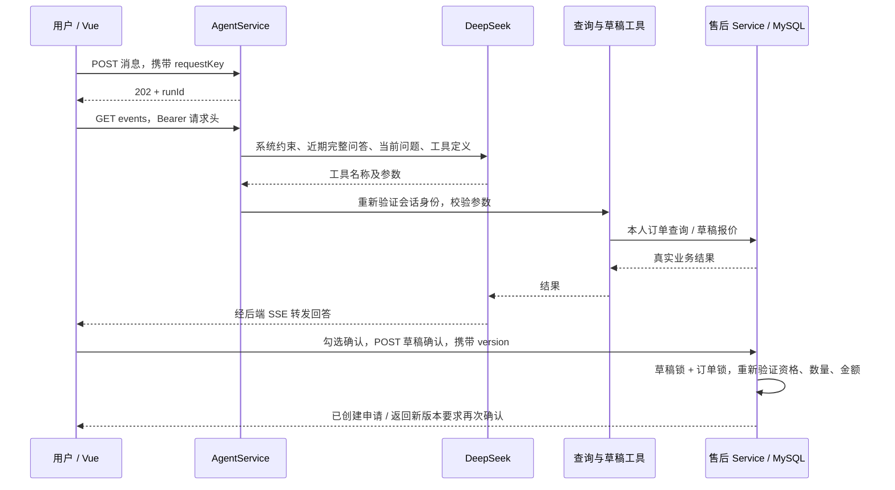

# DeepSeek 售后 Agent（第一版）

2026-09-29 新增 `searchPolicies` 政策检索工具及持久化来源卡片。Ollama 配置、V5 迁移及知识库发布流程见 [RAG 说明](KNOWLEDGE_RAG.md)。真实本地向量模型待用户安装后联调；下方首轮评测记录保持原范围。

## 启动与配置

保留原有 local、MySQL、Redis 配置，在 IDEA 的后端 Run Configuration → Environment variables 中增加：

```dotenv
AI_ENABLED=true
DEEPSEEK_API_KEY=你的 DeepSeek API 密钥
DEEPSEEK_MODEL=deepseek-flash
DEEPSEEK_BASE_URL=https://api.deepseek.com
```

模型名称可通过 DEEPSEEK_MODEL 调整，以你的 DeepSeek 账户实际可用模型为准。密钥只设置在后端运行环境，不填写到 Vue/VITE_ 变量、application.yml、聊天框或 Git 中。`.env.example` 仅供参考，Spring Boot 不自动读取 .env。

重启 local 后端，Flyway 自动执行 V4，新增会话、消息、执行任务、工具审计、售后草稿五张表；已有账号、订单和售后单保留。前端执行 `npm run dev`，登录后进入“智能售后”。没有配置密钥时页面提示未启用，发送接口返回 503；原有订单和手动售后功能仍可使用。

依赖为 Spring AI 2.0.1 的 `spring-ai-deepseek` 和 `spring-ai-client-chat`。采用手工构建 DeepSeekChatModel，而非强制启动时校验密钥的自动配置。第一版显式关闭 thinking，输出不展示 reasoning_content。

## 从问题到申请



DeepSeek 负责理解、追问、选择工具和解释结果。金额、期限、权限、数量、申请状态由 Java 代码判断。模型没有直接建单、审核、撤销或退款工具。

现有七个工具：

| 工具 | 作用 |
| --- | --- |
| listMyOrders | 本人订单分页，每页 10 条 |
| getMyOrder | 本人订单和商品项详情 |
| getMyShipments | 本人订单物流 |
| getAftersaleEligibility | 当前售后资格、数量和金额 |
| listMyAftersales | 本人售后申请分页 |
| getMyAftersale | 本人申请及处理记录 |
| createAftersaleDraft | 生成 15 分钟有效的退货退款草稿 |

订单详情、物流、资格三个查询工具的 id 支持内部数字 ID 或完整业务订单号（如 DEMO-1002）。后端按当前用户精确匹配订单号，不从 DEMO-1002 截取 1002 猜测主键。创建草稿仍必须使用查询结果中的内部订单 ID 和商品项 ID。

工具不接收 userId。后端在工作线程中为每次工具调用重新验证当前登录 Token，设置并清理认证上下文，复用现有 Service 的所有权检查；客服通过 Agent 查询时也只能查询自己的数据。Token 只保留在服务端本次任务闭包中，不传给模型或写入执行记录。

## API

均使用 `Authorization: Bearer ...`，`/api` 为前缀。Controller 的 Swagger 注解是可执行契约。

| 方法 | 路径 | 结果 |
| --- | --- | --- |
| GET | /agent/status | available、model、message |
| POST | /conversations | title，201 创建会话 |
| GET | /conversations | 最近 100 个本人会话 |
| GET | /conversations/{id}/messages?before={messageId} | 每页最多 50 条，返回时间正序 |
| POST | /conversations/{id}/messages | content、requestKey，202 返回任务 |
| GET | /conversations/{id}/active-run | 执行中任务，无则 204 |
| GET | /agent-runs/{id} | 状态、完成后文本、模型、已报告用量 |
| GET | /agent-runs/{id}/events | SSE，流断开不重新调用模型 |
| POST | /agent-runs/{id}/cancellation | 停止本次任务 |
| GET | /conversations/{id}/drafts | 最近 50 个草稿 |
| GET | /aftersale-drafts/{id} | 当前草稿和版本 |
| POST | /aftersale-drafts/{id}/confirmation | version、confirmed=true |
| POST | /aftersale-drafts/{id}/cancellation | 取消未提交的草稿 |

会话、任务、草稿 ID 是 UUID；原订单、商品、申请和消息 ID 仍是以字符串返回的 BIGINT。

消息在数据库中按原始 BIGINT 列排序，而不是 CAST 后的字符串别名；游标使用同一数值列。前端按 runId + role 保持气泡身份，流式完成时合并历史记录，不移除再创建回复气泡，也不丢弃已加载的更早消息。前端回归测试可用 `cd frontend; npm test` 运行。

发送消息示例：

```json
{
  "content": "帮我查询最近的订单",
  "requestKey": "a6b5a772-0d45-4a97-bc1e-a4567889d381"
}
```

相同用户、相同 requestKey、相同会话和内容返回原任务，不重复调用模型；内容不一致返回 409。一次新提问使用新键。网络超时后的重试必须沿用原键。

SSE 事件：

- status：真实工具进度提示，`{message}`。
- delta：回答文本，`{text}`。当前 DeepSeek 网关在工具调用时清除此前阶段话语，等最终回答完成后一次发送正文；status 和 draft 事件仍实时发送。这样避免英文前缀和重复进度进入最终回复，但不再逐 Token 展示正文。
- draft：结构化草稿卡片。
- snapshot：已结束任务的完整文本，`{text}`，替换而非追加。
- done：完整 RunVO，status 为 SUCCEEDED / FAILED / CANCELLED。
- heartbeat：连接保活。

任务失败也发送 done，并带 errorMessage；失败或停止后的部分回答标记为不完整。前端使用 fetch 读取 SSE，以便携带 Bearer 请求头，不把 Token 放入 URL。文本按纯文本渲染，不使用 v-html。

刷新时先读取持久化消息和 active-run，再连接同一个 runId。客户端断开不会取消任务，也不会自动重发消息。服务重启后的旧任务不自动重放付费请求；100 秒租约到期后在查询/发送时回收为 FAILED。历史已保存的有效草稿仍可确认。

## 草稿确认与并发

草稿只是报价快照，不预占数量。确认接口锁定草稿及订单，重新计算资格和报价：

1. 非本人、过期、取消、版本不符、资格不满足，拒绝提交。
2. 可申请数量或金额变化：返回 HTTP 200、`confirmed=false`、新版本草稿。前端清空勾选，要求重新核对。
3. 一切一致：创建售后单并占用数量，草稿标记 CONFIRMED。
4. 重复或并发确认已提交的草稿：返回同一张售后单。建单使用稳定键 `draft-{UUID}`，由数据库唯一键和事务保证幂等。

已审核通过只代表待退货。已实现退回物流登记、客服收货与模拟退款；未接入真实资金退款、真实快递服务或换货。取消模型任务不撤回已经生成的草稿，更不撤回已确认的申请；申请撤销仍在售后页面操作。

## 执行边界与存储

- 每用户最多 1 个执行中任务，每分钟最多创建 10 个新任务；幂等重试不消耗新任务配额。
- 实例内 4 个执行线程、等待队列 8 个；拥塞会保存失败状态。
- 每任务最多 8 次工具调用，输入最多 2,000 字符，累计回答最多 16,000 字符，单次模型请求 max_tokens=2048。
- 模型流总等待 85 秒，任务上限 90 秒；连接超时 5 秒；不自动重试付费调用。
- 历史窗口最多 8 个成功问答对、18,000 字符。失败或取消任务不加入下一轮模型上下文。
- 单工具结果最多 18,000 字符，过大时提示缩小范围。
- MySQL 保存消息、任务终态、模型名称、供应商已报告的输入/输出 Token、工具名称/状态/耗时。未报告的用量记为 0，不代表免费；取消/失败情况下用量可能不完整，不作为账单。
- Redis 复用现有可撤销登录会话缓存；会话历史和任务不以 Redis 作为唯一数据源。
- 执行中流事件暂存在本实例内存，结束后可从数据库读取结果。当前为单实例方案，多副本需要共享事件通道和任务调度设计。
- 模型语义效果、歧义澄清、提示注入鲁棒性还需用真实模型评测；权限和确认边界由后端硬性控制。

## 本地验收

示例依次提问：

1. “帮我查询最近的订单。”
2. “查询订单 1001 的物流和售后资格。”
3. “我要为订单 1001 的鼠标申请退货退款，数量 1，原因质量问题，描述是按键失灵。请生成草稿。”
4. 检查草稿中的商品、数量、原因和金额，勾选后确认提交。
5. 打开申请链接核对，回到聊天询问“查询我的售后进度”。
6. 刷新页面，确认历史消息、草稿和已创建申请仍存在。

演示订单 ID 仅适用于种子数据仍可申请的状态；应先以查询结果为准。

测试分层：
- DeepSeekProtocolTest：本机 HTTP 模拟 DeepSeek SSE，走真实 Spring AI 适配器，验证工具往返、中文文本和用量汇总；无外网、无真实密钥。
- AgentIntegrationTest：隔离 MySQL / Redis + 模拟 ModelGateway，验证身份隔离、参数校验、会话与幂等、工具上限、SSE、失败/取消、草稿确认并发、报价更新、过期及租约恢复。
- 既有身份、订单、售后和缓存测试继续回归。
- 普通 `mvn test` 无环境变量时跳过数据库集成测试。完整集成测试需显式设置 AUTH_TEST_ENABLED=true、MAPPER_TEST_URL、MAPPER_TEST_USERNAME、MAPPER_TEST_PASSWORD、REDIS_TEST_PORT，且必须指向专用测试实例。

2026-09-29 已完成首轮真实 DeepSeek 评测：10 个场景、11 轮对话的自动业务检查通过，回复审阅仍发现语言和金额措辞等问题，见 [基线报告](evaluations/baseline-v1-20260929/REPORT.md)。本地协议验证与真实模型基线分别记录，首轮结果不代表完整的模型质量验收。

2026-09-28 验证结果：隔离 MySQL 33309 / Redis 16381 上 Maven verify 的 42 项测试全部通过；Vue 类型检查和构建通过。临时前端 5174 / 后端 18083 / 本地模型 18084 的浏览器联调完成订单查询、草稿生成、确认建单、申请详情、刷新恢复；确认前数据库申请数为 0，确认后为 1。测试服务在验证结束后关闭，未操作日常 3306 数据库或 8080 服务。
