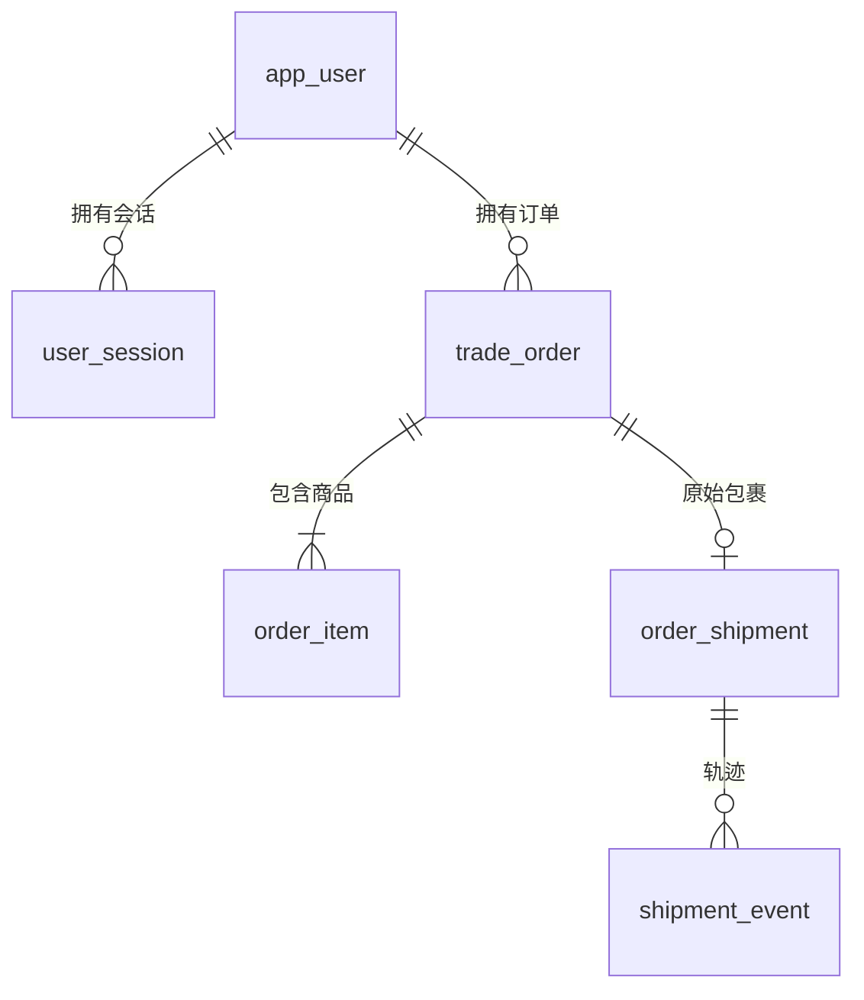

# 用户与订单数据库设计 · 第一批

V7 新增 `aftersale_refund` 记录模拟退款流水，扩展售后状态为 REFUND_PENDING、REFUND_FAILED、COMPLETED。退款请求键在单售后单内唯一，模拟渠道编号全局唯一；记录金额、前序失败请求键、场景、结果、操作者与时间。流水、售后状态和事件同事务写入。完成数量仍计入不可再申请数量，详见 [模拟退款](SIMULATED_REFUND.md)。

后续已增加 V3 售后申请/记录表，以及 V4 会话、消息、Agent 任务、工具调用记录、售后草稿五张表。V4 用 UUID 标识会话/任务/草稿；消息采用 BIGINT 游标分页，任务以 (user_id, request_key) 唯一约束防止重复执行。草稿保存报价、版本、有效期和最终申请 ID，确认时重新核对业务规则。详见 [AGENT.md](AGENT.md)。

本批对应六个用户、会话、订单接口，提供 MySQL 8.0.43 建表迁移和手动演示数据。六组 Mapper/PO、identity 认证 Service 与 order 查询 Service 已实现，见 PERSISTENCE.md、AUTHENTICATION.md、ORDER_QUERIES.md。开发验证使用隔离实例，没有连接或修改日常使用的 3306 数据库。

## 文件与执行顺序

1. `deploy/mysql/01-create-database.sql`：手动建库。
2. 保持 V1 不变；应用使用 local 配置启动后，Flyway 依次执行 V1、V2。V2 位于 `backend/src/main/resources/db/migration/V2__create_identity_and_order_tables.sql`。
3. 停止应用后，在专用开发库手动执行 `deploy/mysql/02-seed-demo-data.sql`。它不在 Flyway 路径内，不会随应用启动自动导入。

以后改表新增 V3、V4，不修改已经执行过的版本。DDL 失败可能留下部分已创建的表；MySQL 的多条 DDL 不构成一个可整体回滚的事务。先检查 Flyway 历史和实际结构，再处理失败，不能通过随意 repair 或修改校验和绕过问题。

## 表关系



| 表 | 关键字段 | 用途与接口映射 |
| --- | --- | --- |
| app_user | username、password_hash、display_name、role、enabled | 登录校验、当前用户；role 为 CUSTOMER / STAFF |
| user_session | user_id、token_hash、expires_at、revoked_at | 创建、认证、撤销当前会话 |
| trade_order | user_id、order_number、status、paid_amount、paid_at、signed_at | 订单列表和详情 |
| order_item | order_id、sku_id、product_name、specification、quantity、paid_amount | 订单商品快照及购买数量 |
| order_shipment | order_id、carrier、tracking_number、status、shipped_at、delivered_at | 原订单物流；一个订单最多一个包裹 |
| shipment_event | shipment_id、occurred_at、description | 物流轨迹，按 occurred_at、id 升序 |

完整字段、类型、默认值、索引和约束以 V2 SQL 为准。外键使用 RESTRICT，避免删除用户时连带删除交易记录。没有引入商品主表、地址表、支付表；SKU 只保存外部标识，商品名称和规格保留下单快照。

## 类型与数据口径

- 主键使用有符号 BIGINT 自增，Java 用 Long，对外转字符串。19 位路径参数还需在 Service 中检查 Long 上界，禁止转换溢出导致 500。应用不接受客户端指定主键。
- 金额使用 DECIMAL(12,2)，Java 用 BigDecimal，响应为两位小数字符串。商品行 paid_amount 是整行实付金额，订单 paid_amount 等于商品行金额之和。退款不修改原始实付金额。
- PENDING_PAYMENT / CANCELLED 的实付金额为 0、paid_at 为空；首版 CANCELLED 仅表示未支付取消。PAID / SHIPPED / COMPLETED 必须有支付时间，允许优惠后 0 元订单。只有 COMPLETED 有 signed_at，表示已签收完成。
- totalQuantity 由商品 quantity 求和，不单独存冗余列。availableAftersalesQuantity 暂不存列：尚无售后申请时等于购买数量；接入售后后扣除有效占用和已处理数量。它不代表当前允许发起售后，资格仍需另行判断。
- 所有 DATETIME(3) 按 UTC 存储。local 配置为 JDBC serverTimezone=UTC，并在连接初始化执行 SET time_zone = '+00:00'。数据库客户端手动写数据也必须设置 UTC。Java 实现需明确 UTC 转换，API 返回带偏移的时间，前端负责本地展示。
- username 使用 utf8mb4_0900_as_cs，区分大小写和重音。后续登录/创建账号统一拒绝首尾空白；不能依赖数据库自动去空格。状态、币种、订单号和密码摘要使用区分大小写的 ASCII 排序规则。

## 认证设计

密码不保存明文。演示数据采用 `{pbkdf2}` + 十六进制 `salt || derivedKey`，参数：PBKDF2-HMAC-SHA256、600000 次迭代、16 字节随机盐、32 字节结果、无额外 secret。实现 Spring Security 的 PasswordEncoder 时必须显式使用这些参数并注册该前缀，不能直接假设框架默认 `{pbkdf2}` 参数相同。新账号逐个生成随机盐；种子账号共用公开的测试摘要，仅用于本地演示。

访问令牌使用安全随机源生成至少 32 字节随机值，再编码为 Base64URL；数据库仅保存原始令牌文本 UTF-8 字节的 SHA-256 摘要（32 字节）。只在登录响应返回一次明文令牌，日志和数据库不记录它。高熵令牌可以快速摘要，用户密码必须使用慢哈希，二者不能混用。

认证需同时判断：摘要存在、未过期、未撤销、账号 enabled=true。撤销只针对当前令牌，将 revoked_at 置为当前 UTC 时间。已撤销记录保留到原 expires_at，使同一令牌再次注销仍可返回 204；不能因重复注销更新撤销时间。过期会话由后续清理任务按 expires_at 删除。种子数据不创建任何有效会话。

## 索引与权限

| 查询 | 索引与约束 |
| --- | --- |
| 按用户名登录 | app_user.username 唯一索引 |
| 认证令牌 | user_session.token_hash 唯一索引 |
| 清理过期会话 | user_session.expires_at 索引 |
| 当前用户订单分页 | (user_id, created_at DESC, id DESC) |
| 当前用户按状态分页 | (user_id, status, created_at DESC, id DESC) |
| 精确订单号查询 | order_number 唯一索引，同时在 WHERE 中限制 user_id |
| 订单商品 | (order_id, id) |
| 原订单包裹 | order_id 唯一索引，限制一个包裹 |
| 包裹轨迹 | (shipment_id, occurred_at, id) |

索引不能替代鉴权。详情和物流查询必须通过 `id + 当前认证 user_id` 查订单；不存在或不属于当前用户统一 404。STAFF 在这些用户接口中也不绕过归属检查。未来客服后台使用独立接口和权限规则。

## 数据库与 Service 的责任边界

数据库检查枚举、金额非负、数量正数、时间先后、关联存在性和唯一性。以下跨表规则必须在 Service 事务中实现，不能仅依赖外键或 CHECK：

- 订单至少包含一条商品记录，商品行金额合计等于订单实付金额。
- 未发货订单没有包裹；发货时间不早于支付；已签收包裹和订单的签收时间一致。
- 订单状态按允许的路径迁移；CHECK 只能限制当前值，不能限制历史迁移路径。
- 后续售后数量占用使用事务及并发控制，防止同一商品超量申请；退款金额使用明确的优惠分摊及尾差规则。

## 手动导入演示数据

先配置 DB_USERNAME / DB_PASSWORD 并使用 local 启动应用完成 Flyway 迁移。导入时停止应用，只在专用开发库操作。使用有临时 CREATE ROUTINE、ALTER ROUTINE、EXECUTE 权限的开发账号；常规应用账号不需要这些权限。

IDEA / Navicat：连接本机 MySQL，打开 `deploy/mysql/02-seed-demo-data.sql` 并运行整个文件即可。文件已包含 `USE aftersales_agent` 和导入开关，无需额外执行或拼接 SQL；末尾会查询三个演示账号。若开发库名称不同，先修改文件开头的 USE 语句。

也可从项目根目录启动 mysql 客户端（未配置 PATH 时使用 mysql.exe 绝对路径）：

```text
mysql --host=127.0.0.1 --port=3306 --user=你的开发账号 --password --default-character-set=utf8mb4 aftersales_agent
```

在 mysql 提示符中执行，密码通过提示交互输入，不写入命令历史或仓库：

```sql
SOURCE deploy/mysql/02-seed-demo-data.sql;
```

首次导入要求六张业务表为空；用事务插入全部数据和 project_metadata 中的 demo_seed_version=1。重复执行会跳过并保留现有修改，不重置数据或重复插入。导入失败会回滚业务数据；客户端若遇错中止，可能残留临时存储过程，下次执行会先清理该过程。不要在应用运行、真实业务库或多个终端中并行执行。

三个演示账号为 demo_customer、demo_other、demo_staff，公开演示密码均为 `123`。已导入的数据库可运行 `deploy/mysql/03-reset-demo-passwords.sql` 更新密码；种子脚本重复执行会跳过已有数据。数据库仍使用 PBKDF2 摘要保存密码。手工导入后，可在 local 模式使用登录接口；scaffold 仍返回 501。不得用于部署环境。隔离自动化测试的合成账号仍使用各自测试夹具密码。

| 订单号 | 归属 | 场景 |
| --- | --- | --- |
| DEMO-1001 | demo_customer | 近期签收，两类商品，其中一行购买 2 件 |
| DEMO-1002 | demo_customer | 35 天前签收，供未来超期规则测试 |
| DEMO-1003 | demo_customer | 已发货，物流运输中 |
| DEMO-1004 | demo_customer | 已支付，尚未发货，物流返回空列表 |
| DEMO-1005 | demo_customer | 待支付，实付 0 |
| DEMO-1006 | demo_customer | 未支付取消 |
| DEMO-1007 | demo_other | 另一用户订单，供越权测试 |

时间相对首次导入时刻生成，重复执行不会刷新时间。近期订单会随时间自然变旧。售后期限、不可售后类别、已占用数量等数据，待售后规则和表设计后再补充；当前不能宣称已实现这些规则。

## 后续开发顺序

MyBatis、会话认证、注销及带归属限制的订单查询 Service 已完成。集成测试已覆盖跨用户访问、分页排序、金额序列化和空物流。下一步联调 Vue 页面，再开展售后模块。

## 退回物流与收货扩展（V6）

V6 在 aftersale_request 新增 return_carrier、return_tracking_number、return_registered_at、received_at、receipt_note，扩展状态及事件校验。RETURN_SHIPPED 和 RETURN_RECEIVED 仍占用数量与金额；用户只能登记本人申请，客服不能确认自己的退货。流程、接口与测试见 [退回物流说明](RETURN_SHIPMENT.md)。
