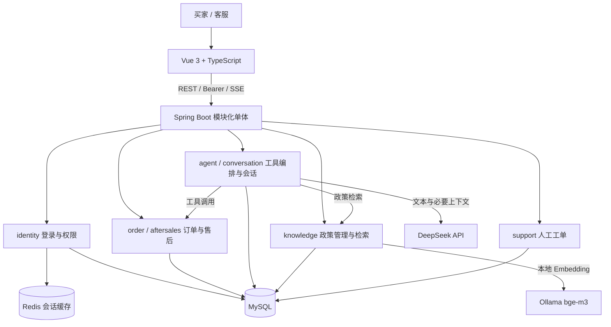

# 本地交付与演示手册

交付日期：2026-09-29。面向学习、简历展示和本地复现；不包含生产环境部署承诺。

## 1. 架构与业务边界



MySQL 保存账号、会话、订单、申请、退款流水、会话消息、政策与向量、任务审计、工单和图片二进制。Redis 用于会话认证缓存。图片仅用于人工查看，不发送给 DeepSeek；RAG 原始文档在本机处理，但检索出的政策片段会随问答发送给云端文本模型，因此不能理解为所有内容都不离开本机。

模型选择工具和生成解释，后端决定访问权限、售后资格、金额与状态。模型只能生成申请草稿，正式提交需要用户确认。系统采用一个后端应用，不是微服务或多 Agent 系统。

## 2. 环境与启动顺序

需要 Java 21+（本机使用25，编译目标21）、Maven、Node.js `^20.19.0 || >=22.12.0`、MySQL 8.0、Redis。启用政策向量检索还需要 Ollama 与 bge-m3；启用文本 Agent 需要 DeepSeek API 密钥。

1. 启动 MySQL（默认3306）和 Redis（默认6379），Redis认证信息应与后端一致。
2. 在专用开发实例执行 `deploy/mysql/01-create-database.sql`。它及演示脚本默认使用 `aftersales_agent`；改库名时需同步调整脚本，不能只改环境变量。
3. IDEA 导入根目录 pom.xml，设置 SDK，刷新 Maven。运行类为 `com.example.aftersales.AftersalesApplication`。
4. 在运行配置中设置以下变量；凭据仅放本机，不提交仓库。

```text
SPRING_PROFILES_ACTIVE=local
DB_USERNAME=你的开发账号
DB_PASSWORD=你的本地数据库密码
REDIS_HOST=127.0.0.1
REDIS_PORT=6379
REDIS_PASSWORD=按本机配置填写
AI_ENABLED=true
DEEPSEEK_API_KEY=你的密钥
DEEPSEEK_MODEL=deepseek-flash
EMBEDDING_PROVIDER=ollama
EMBEDDING_BASE_URL=http://127.0.0.1:11434
EMBEDDING_MODEL=bge-m3
```

未启用模型时使用 `AI_ENABLED=false`；未安装 Ollama 时可设 `EMBEDDING_PROVIDER=disabled`，先验证普通售后业务。`.env.example` 仅为说明，Spring Boot 不自动读取 `.env`。默认后端8080，可通过 SERVER_PORT 修改。

5. Ollama：先执行 `ollama pull bge-m3`，用 `ollama list` 确认模型存在。Windows桌面服务已运行时无需再启动；未运行可执行 `ollama serve`，默认11434端口。
6. 启动后端，Flyway 自动应用 V1–V10；访问 `http://127.0.0.1:8080/actuator/health`。默认 scaffold 健康检查通过不代表业务可用，业务必须使用 local。
7. 首次空业务库执行整个 `deploy/mysql/02-seed-demo-data.sql`。已有数据时不要清库重导；旧演示账号需要改为密码123时执行 `03-reset-demo-passwords.sql`。补充可售后订单使用 `04-add-demo-completed-orders.sql`，重复执行保留原记录与日期。
8. 启动前端：

```powershell
cd frontend
npm ci
npm run dev
```

访问 `http://127.0.0.1:5173`。Vite代理默认转发到8080；后端端口变化时按 frontend/.env.example 设置 BACKEND_URL 并重启 Vite。浏览器刷新不能代替后端重启加载 Java 改动。

9. 登录 `demo_staff / 123`，进入政策知识库录入资料并发布；发布成功后才参与检索。可参考 `docs/knowledge/demo-policies.json`。批量导入脚本 `scripts/Import-DemoPolicies.ps1` 需要本机终端变量 POLICY_STAFF_TOKEN，只创建草稿，不自动发布；不要将令牌写进文档或Git。

## 3. 演示流程（约10分钟）

| 步骤 | 角色与操作 | 检查点 |
| --- | --- | --- |
| 1 | 买家 demo_customer 登录，查看我的订单、详情和物流 | 本人订单可见；demo_other 不能读取这些订单 |
| 2 | 智能售后提问“查询可以售后的订单” | 使用聚合工具，显示商品剩余数量和金额，超过一页时提示继续 |
| 3 | 提问“退货需要准备什么材料？” | 先检索已发布政策，展示原文来源；无资料时不能编造 |
| 4 | 对符合资格的订单明确提出退货，补充商品、数量、原因、描述 | 生成草稿；此时还不是正式申请 |
| 5 | 核对草稿并确认提交，打开申请详情 | 生成待审核申请，数量和金额由后端校验 |
| 6 | 上传一张JPEG/PNG凭证，刷新详情 | 图片保留；每单最多5张、每张5MB |
| 7 | 客服查看凭证，填写意见并审核通过 | 进入待退货，不代表退款成功 |
| 8 | 买家登记模拟承运商及单号；客服确认收货 | 物流与收货时间线完整 |
| 9 | 客服执行模拟退款，买家查看结果 | 可演示失败后重试或超时未知后回查；明确标记模拟 |
| 10 | 买家转人工并共享快照；客服领取回复；查看执行监控 | 快照只含提交时分享内容，监控展示工具调用与错误 |

测试订单 DEMO-2001～2005 在追加脚本首次执行时设为昨天签收。期限随真实时间流逝，不会因重跑脚本续期；已完成售后占用的数量也不会重置。演示前核对资格，避免用已经处理完的商品重复申请。

## 4. 验证命令与证据

前端：在 frontend 目录执行 `npm run build`、`npm test`。普通 Maven 测试可能跳过依赖环境开关的集成测试，不能据此宣称业务全量验收。

隔离业务回归在仓库根目录运行：

```powershell
./scripts/Run-AgentBaseline.ps1 -AftersaleTest `
    -MySqlBin '你的MySQL安装目录/bin' `
    -RedisBin '你的Redis安装目录'
```

脚本面向 Windows，本机默认 MySQL 路径为 `D:\Program Files\MySQL\MySQL Server 8.0\bin`，Redis为 `E:\Redis-x64-5.0.14.1`。使用独立33310/16382端口，创建临时服务并在结束后关闭；不会操作日常3306/6379实例。日志位于 `backend/target/agent-evaluation/services-*/maven.log`，不纳入Git。此模式不调用真实模型。

- 2026-09-29 最近一次隔离回归：57项通过，0失败、0错误、0跳过。
- 前端已有5项测试与构建已通过；它们不是全部页面的自动浏览器验收。
- 历史真实模型报告：[Agent基线](evaluations/baseline-v1-20260929/REPORT.md)、[RAG基线](evaluations/rag-baseline-v1-20260929/REPORT.md)。真实模型评测需要显式启用并可能产生费用。
- 最新聚合资格工具尚未完成真实DeepSeek复测；监控中核对工具选择后，再评估回答准确性。不要沿用历史报告声称本轮模型结果全部通过。

## 5. 已知限制与排查

- 未接真实支付、实时快递、换货、实时客服聊天、图片识别或自动告警。
- RAG使用MySQL JSON向量与Java检索，适合小规模资料；超过5000个待检索片段会拒绝，尚无专用向量索引、PDF/Word解析或后台异步入库。
- 图片内容使用MySQL MEDIUMBLOB，上传后不可编辑/删除；增长后应迁移私有对象存储。重编码会去除元数据，不保证原文件逐字节保留。
- 单轮最多8次工具调用、总任务90秒；模型仍可能错误选择工具，后端限制保留。
- 服务默认监听本机。未交付Docker Compose、CI流水线、生产TLS/备份/告警方案，也未在全新机器或高负载下完成验收。
- 8080/5173占用：先确认已有服务，避免重复启动；改端口需同步前端代理。
- 登录503：检查MySQL/Redis连接与环境变量；501：检查是否误用scaffold。
- 检索为空：检查Ollama、模型、政策发布状态、生效日期与商品范围。
- 工具次数耗尽：看执行监控，确认是否走聚合工具；不要仅提高上限掩盖反复调用。

## 6. 简历与面试说明建议

可介绍“基于Spring AI构建电商售后Agent，结合RAG政策检索和业务工具完成查询、草稿确认、审核、退回收货与模拟退款；通过事务、权限、幂等及执行审计约束模型动作”。

讲解重点：模型与业务规则如何分工、为什么必须用户确认、金额分摊与并发数量控制、RAG来源与失败评测、一次聚合工具查询如何减少调用次数、模拟退款未知结果为何先回查。仅引用报告中有证据的指标，不编造生产用户量、性能提升或线上支付经验。
